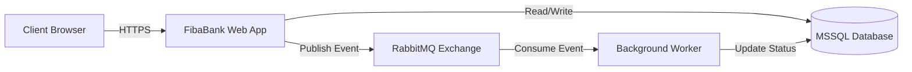
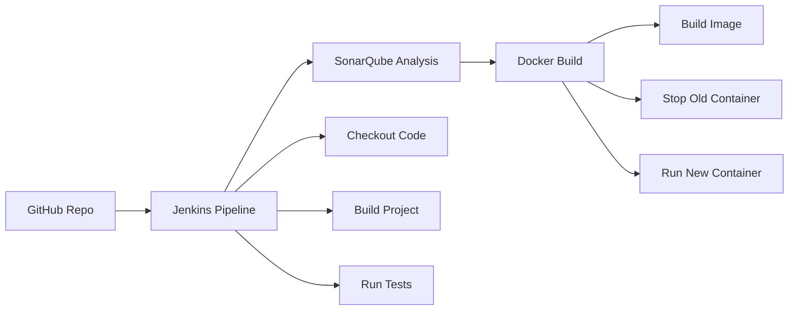

# 🏦 FibaBank — Modern Banking & Industrial DevOps Ecosystem


---

##  Overview

**FibaBank** is a high-performance, scalable banking simulation designed to demonstrate **Industrial DevOps Pipeline** processes.

It bridges the gap between modern software architecture and enterprise-grade infrastructure automation.

This project serves as a comprehensive case study for:

* Continuous Integration (CI)
* Continuous Deployment (CD)
* Static Code Analysis
* Event-Driven Architecture
* Containerized Infrastructure

---

## 🚀 Features

* **Event-Driven Architecture**
  Asynchronous money transfers and transaction processing using RabbitMQ.

* **Automated CI/CD Pipeline**
  Zero-touch deployment from code commit to production via Jenkins.

* **Quality Gates**
  Static code analysis, bug detection, and security auditing with SonarQube.

* **Full Containerization**
  Application, Database, Broker, and DevOps tools fully isolated using Docker.

* **Resilient Storage**
  Enterprise-grade relational integrity powered by MSSQL Server.

* **Modern MVC Pattern**
  Modular ASP.NET Core MVC architecture.

---

##  Technology Stack

### Application & Backend

| Component | Technology            | Justification                     |
| --------- | --------------------- | --------------------------------- |
| Framework | .NET 8 / .NET 10      | High performance & cross-platform |
| Web UI    | ASP.NET MVC           | Razor server-side rendering       |
| Database  | MSSQL Server 2022     | ACID compliance & security        |
| ORM       | Entity Framework Core | Code-First migrations             |
| Messaging | RabbitMQ              | Async service communication       |

---

### DevOps & Infrastructure

| Component        | Technology       | Purpose                     |
| ---------------- | ---------------- | --------------------------- |
| Containerization | Docker & Compose | Environment consistency     |
| CI/CD            | Jenkins          | Pipeline orchestration      |
| Code Analysis    | SonarQube        | Quality & security scanning |

---

## 🏗️ Architecture

### System Context Diagram



---

## 🔄 DevOps Pipeline Flow



---

##  Getting Started

###  Prerequisites

* Docker & Docker Compose
* Git
* .NET SDK (optional for local run)

---

##  Quick Start

### 1️. Clone Repository

```bash
git clone https://github.com/Rozagle/FibaBank_.git
cd FibaBank_
```

---

### 2. Start Infrastructure

```bash
docker-compose up -d
```

---

### 3️. Build Application Image

```bash
docker build -t fibrabank-app -f FibaPlus_Bank/Dockerfile .
```

---

### 4️. Run Application Container

```bash
docker run -d --name fibrabank-web \
  --network fibra-network \
  -p 7000:8080 \
  fibrabank-app
```

---

## 🌐 Service Access

| Service     | URL                                              | Credentials   |
| ----------- | ------------------------------------------------ | ------------- |
| Web App     | [http://localhost:7000](http://localhost:7000)   | —             |
| SonarQube   | [http://localhost:9000](http://localhost:9000)   | admin / admin |
| RabbitMQ UI | [http://localhost:15672](http://localhost:15672) | guest / guest |

---

## 🐳 Docker Services

| Service       | Port (Host:Container) | Description          |
| ------------- | --------------------- | -------------------- |
| fibrabank-web | 7000:8080             | ASP.NET Core Web App |
| fibra-db      | 1433:1433             | MSSQL Server         |
| fibra-rabbit  | 5672 / 15672          | RabbitMQ Broker      |
| sonarqube     | 9000:9000             | Code Analysis        |

---

## 📂 Project Structure

```
FibaBank_/
├── Jenkinsfile
├── docker-compose.yml
├── FibaPlus_Bank/
│   ├── Dockerfile
│   ├── appsettings.json
│   ├── Controllers/
│   │   ├── AdminController.cs
│   │   ├── TransferController.cs
│   │   └── LoginController.cs
│   ├── Models/
│   ├── Views/
│   ├── Migrations/
│   ├── Consumers/
│   └── Program.cs
└── README.md
```

---

## ⚙️ Development

### Local Development (Without Docker)

**Requirements**

* MSSQL LocalDB
* RabbitMQ Server

---

### appsettings.json Example

```json
{
  "ConnectionStrings": {
    "DefaultConnection": "Server=localhost;Database=FibaPlusBankDb;User Id=sa;Password=YourPassword;TrustServerCertificate=True;"
  },
  "RabbitMQ": {
    "HostName": "localhost",
    "UserName": "guest",
    "Password": "guest"
  }
}
```

---

### Run Locally

```bash
dotnet restore
dotnet run --project FibaPlus_Bank
```

---

## 📄 License

This project is developed as a **portfolio & case study** project for demonstrating modern Banking + DevOps practices.


